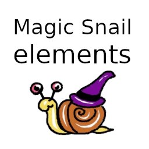

Magic Snail
===========

Magic Snail is a game written in lua with [löve](https://love2d.org).
A documentation about löve can be found in their [wiki](https://love2d.org/wiki/Main_Page).

This game was created during the [Hetzner Game Jam 2019](https://github.com/hetzneronline/game-jam).
It is licensed under GNU Affero General Public License version 3 or later.

Playing the Game
================

You can either use the instructions for your operating system below, or install [löve](https://love2d.org) and then download and open [magic-snail.love](https://github.com/magic-snail/magic-snail/releases/latest/download/magic-snail.love).

Linux
-----

1. Download [magic-snail-linux.AppImage](https://github.com/magic-snail/magic-snail/releases/latest/download/magic-snail-linux.AppImage)
1. Make it executable: `chmod u+x magic-snail-linux.AppImage`
3. Execute `./magic-snail-linux.AppImage`

Windows
-------

1. Download [magic-snail-win64.zip](https://github.com/magic-snail/magic-snail/releases/latest/download/magic-snail-win64.zip)
2. Extract it
3. Execute `magic-snail.exe`

MacOS
-----

1. Download [magic-snail-macos.zip](https://github.com/magic-snail/magic-snail/releases/latest/download/magic-snail-macos.zip)
2. Extract it
3. Open `magic-snail` (ignore warnings about missing verification)
