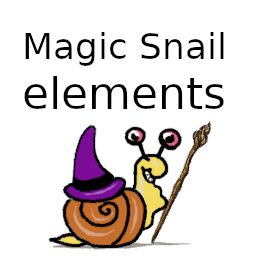

Magic Snail
===========

Magic Snail is a game written in lua with [löve](https://love2d.org).
A documentation about löve can be found in their [wiki](https://love2d.org/wiki/Main_Page).

This game was created during the [Hetzner Game Jam 2019](https://github.com/hetzneronline/game-jam).
It is licensed under GNU Affero General Public License version 3 or later.
